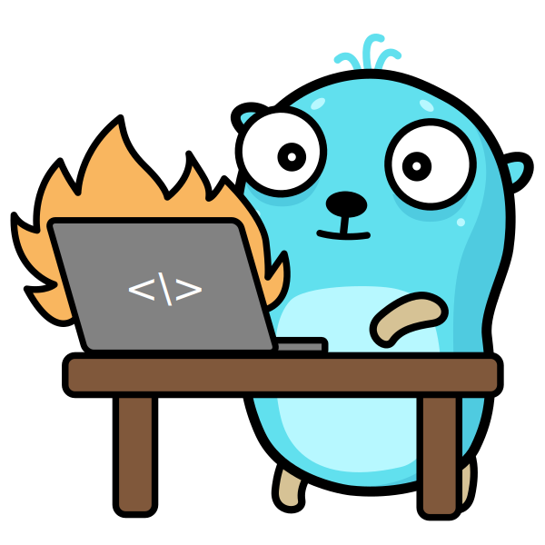

# Huma Playground

A compact, production-conscious REST API example using [Huma v2](https://huma.rocks/) on [Chi](https://github.com/go-chi/chi). It demonstrates API contracts, JSON and CBOR negotiation, RFC 9457 errors, structured observability, Firebase Authentication, Firestore persistence, and a separate Go Cloud Run function without turning a playground into a framework.



<sub>Gopher illustration from [free-gophers-pack](https://github.com/MariaLetta/free-gophers-pack) by Maria Letta.</sub>

## What this example demonstrates

- Huma v2 typed operations and runtime-generated OpenAPI 3.1
- Stoplight Elements interactive API documentation
- JSON and CBOR requests, responses, and Problem Details
- One Huma error pipeline for operation and Chi-level 404, 405, and recovery responses
- Request IDs, trace metadata, operation-aware access logs, and request-scoped Zap loggers
- Cursor pagination with RFC 8288 `Link` headers
- Firebase ID-token verification with revocation checks
- Firestore atomic create, transaction-safe partial update, existence-checked delete, and audit events
- Explicit development-offline, emulator, and live Firebase modes
- Bounded request, upstream response, server, and shutdown work
- Non-root distroless container execution
- A deliberately small, separately deployable Go Functions Framework example
- Required CI execution for both Go modules plus separate emulator-backed coverage

## Requirements

- Go 1.26.5+ (the repository currently pins 1.26.5)
- [Just](https://github.com/casey/just)
- [golangci-lint v2](https://golangci-lint.run/)
- Firebase CLI and Java 21 when running emulator integration tests
- Docker or Podman for container checks

Copy the example environment:

```bash
cp .env.example .env
```

The default configuration is safe for local exploration: the public API starts without cloud credentials and protected Firebase routes return `503 Service Unavailable`.

## Quick start

```bash
just install
just run
```

Open:

- `http://localhost:8080/health`
- `http://localhost:8080/v1/api-docs`
- `http://localhost:8080/v1/openapi.json`
- `http://localhost:8080/v1/openapi.yaml`

Example:

```bash
curl --fail --silent http://localhost:8080/v1/hello
curl --fail --silent \
  -H 'Content-Type: application/json' \
  -d '{"name":"Ada"}' \
  http://localhost:8080/v1/hello
```

## Configuration

| Variable | Default | Purpose |
|---|---|---|
| `HOST` | `0.0.0.0` | Listen host |
| `PORT` | `8080` | Listen port |
| `APP_ENVIRONMENT` | `development` | `development`, `staging`, or `production` |
| `LOG_LEVEL` | `info` | `debug`, `info`, `warn`, or `error` |
| `FIREBASE_MODE` | `offline` | `offline`, `emulator`, or `live` |
| `FIREBASE_PROJECT_ID` | `demo-test-project` outside live mode | Firebase project |
| `FIREBASE_AUTH_EMULATOR_HOST` | unset | Auth emulator address |
| `FIRESTORE_EMULATOR_HOST` | unset | Firestore emulator address |
| `CORS_ALLOWED_ORIGINS` | `*` in development | Comma-separated browser origins; required outside development |
| `GITHUB_TOKEN` | unset | Optional GitHub API bearer token |
| `GOTOOLCHAIN` | set by `.env` | Repository Go toolchain pin |

### Firebase modes

`offline` is development-only. Public routes work; protected routes fail closed with 503. No Firebase SDK client is created.

`emulator` is development-only and requires both emulator host variables as valid `host:port` authorities without a URL scheme or whitespace. Use a `demo-*` project ID. Partial or malformed emulator configuration is rejected at startup.

`live` requires a non-demo project and Application Default Credentials. Emulator variables and `demo-*` projects are rejected. Production and staging also require explicit non-wildcard CORS origins.

These checks prevent accidental use of the Auth emulator outside development, where unsigned test tokens would be unsafe.

`firestore.rules` denies direct client reads and writes. The Admin SDK bypasses those rules, so the API enforces ownership by deriving the only profile document ID from the verified Firebase UID rather than accepting a user ID from the request.

## API

| Method | Path | Description |
|---|---|---|
| GET | `/health` | Liveness probe |
| GET | `/v1/hello` | Default greeting |
| POST | `/v1/hello` | Generate a personalized greeting |
| GET | `/v1/items` | Cursor-paginated static items |
| POST | `/v1/profile` | Create the authenticated user's profile |
| GET | `/v1/profile` | Read the authenticated user's profile |
| PATCH | `/v1/profile` | Partially update the authenticated user's profile |
| DELETE | `/v1/profile` | Delete the authenticated user's profile |
| GET | `/v1/github/owners/{owner}` | GitHub owner information |
| GET | `/v1/github/owners/{owner}/repos` | Up to 30 owner repositories |
| GET | `/v1/github/repos/{owner}/{repo}` | Repository details |
| GET | `/v1/github/repos/{owner}/{repo}/activity` | Cursor-paginated activity |
| GET | `/v1/github/repos/{owner}/{repo}/languages` | Repository language bytes |
| GET | `/v1/github/repos/{owner}/{repo}/tags` | Up to 30 tags |

Profile JSON uses camelCase (`firstName`, `lastName`, `contactEmail`, `phoneNumber`). Firestore uses snake_case (`first_name`, `last_name`, `contact_email`, `phone_number`). `contactEmail` is user-supplied and is not the verified Firebase identity email.

Profile creation uses Firestore create-if-absent semantics, partial updates preserve unrelated stored fields, and deletion uses an existence precondition rather than a read-before-delete transaction.

The sample item price is `priceMinor` plus `currency`. The integer is expressed in the ISO 4217 currency's minor unit.

## Content negotiation and errors

Use `Accept: application/json` or `Accept: application/cbor`. JSON is the default.

Errors are RFC 9457 Problem Details:

- `application/problem+json`
- `application/problem+cbor`

Huma provides the same schema transformation and content negotiation for operation failures and Chi-level errors. Advertised schema links resolve under `/v1/schemas/`.

Operation metadata lists only errors reachable for that operation. Unexpected Firebase and GitHub dependency failures are logged once with request correlation and a safe operation name; clients receive generic Problem Details without upstream internals.

Request bodies are limited to 1 MiB. Unknown query parameters and unknown body properties are rejected. Application request contexts expire before the server write timeout so Firebase and GitHub work is canceled within the response budget.

## Development commands

All repository workflows go through Just so `.env` and `GOTOOLCHAIN` are applied consistently.

| Command | Purpose |
|---|---|
| `just build` | Build both Go modules |
| `just test` | Test both Go modules |
| `just test-race` | Run both modules with the race detector |
| `just lint` | Lint both modules |
| `just fmt` | Format both modules |
| `just fmt-check` | Reject formatting drift |
| `just tidy-check` | Reject module-file drift |
| `just vuln` | Run `govulncheck` against both modules |
| `just workflow-check` | Validate GitHub Actions with `actionlint` |
| `just coverage` | Generate root application coverage reports |
| `just functions-run` | Run the local Functions Framework target |
| `just functions-smoke` | Build and probe the registered function target |
| `just emulators` | Start Auth and Firestore emulators |
| `just test-integration-ci` | Require emulator-backed tests and generate their separate coverage report |
| `just container-smoke` | Build and probe the final non-root image |

`go.work` is optional, local-only convenience. It is ignored intentionally. Every root recipe sets `GOWORK=off` for the nested function module, so clean clones and CI do not depend on a workspace file.

## Firebase emulator tests

Start emulators:

```bash
just emulators
```

Ports:

- Auth: `127.0.0.1:7110`
- Firestore: `127.0.0.1:7130`
- Emulator UI: `127.0.0.1:4000`

Ordinary local tests skip emulator cases when emulators are absent. The required CI recipe sets `REQUIRE_FIREBASE_EMULATORS=1`, so unavailable or broken emulators fail rather than silently reducing coverage. It writes a separate `integration-coverage.*` report; CI does not merge that profile with the fast unit report.

## Separate Go function

`functions/` is an independent Go module. The HTTP registration is at the module root beside `functions/go.mod`, as required by Cloud Run source functions. `functions/cmd/server` is a local Functions Framework runner.

The example intentionally contains one small handler, one test file, and one runner. It does not import Huma, Firebase Admin, or the application observability stack.
Its timestamp layout is deliberately duplicated: sharing one constant would couple two independently built and deployed modules to remove a trivial line.

Run it:

```bash
just functions-run
curl --fail --silent 'http://localhost:8080/?name=Ada'
```

Deploy it as a Cloud Run function, not through Firebase CLI:

```bash
gcloud run deploy huma-playground-hello \
  --source functions \
  --function Hello \
  --base-image go126 \
  --region REGION \
  --allow-unauthenticated
```

Choose authenticated invocation instead when the function should not be public.

## Container and Cloud Run service

```bash
just container-build
just container-smoke
```

The final image is distroless, statically linked, and runs as UID/GID `65532:65532`. The build injects the supplied version into startup logs and OCI labels.

Deploy the already-built image:

```bash
gcloud run deploy huma-playground \
  --image REGION-docker.pkg.dev/PROJECT_ID/REPOSITORY/huma-playground:TAG \
  --region REGION
```

Do not combine this image deployment with `--base-image` or `--automatic-updates`. Go standard-library, dependency, and base-image fixes require rebuilding and redeploying the compiled artifact.

## Architecture

```text
.agents/skills/                 five portable project workflows with Codex UI metadata
.github/agents/                 evidence-based security review profile for GitHub Copilot
cmd/server/                     typed config, composition, lifecycle
internal/http/health/           unversioned liveness transport
internal/http/v1/               Huma operations grouped by resource
internal/http/v1/routes/        route composition
internal/platform/auth/         Firebase verification and Huma auth middleware
internal/platform/firebase/     Firebase Admin client initialization
internal/platform/middleware/   HTTP security, CORS, Vary, Chi access logs
internal/platform/pagination/   transport-independent cursor mechanics
internal/platform/respond/      Chi recovery/errors delegated to Huma
internal/platform/timeutil/     fixed-precision JSON/CBOR timestamps
internal/service/github/        bounded GitHub API adapter
internal/service/profile/       Firestore profile store
internal/testutil/              emulator-only test helpers
functions/                      independent Functions Framework module
```

The application uses constructor-style composition and narrow interfaces. It deliberately does not add a DI container, repository framework, generic service layer, in-process distributed rate limiter, cache, or OpenTelemetry dependency.

Repository guidance follows the canonical [AGENTS.md format](https://github.com/agentsmd/agents.md). Portable skills use
the canonical [Agent Skills specification and documentation](https://github.com/agentskills/agentskills), with the
detailed [format specification](https://agentskills.io/specification), under `.agents/skills/`. See
[AGENTS.md](AGENTS.md) for the working rules and current skill catalog.

## Observability

`obs.HTTPRequestContext` is installed at the Chi boundary so liveness, recovery, 404, 405, and Huma routes share request IDs and trace metadata. Huma routes additionally use `obs.RequestContext` and `obs.AccessLogger` for operation-aware logs.

The local Chi access logger wraps only Chi-only routes and error handlers, preventing duplicate `/v1` access logs. `obs.Logger(ctx)` is intentionally request-bound; process and background work must receive an explicit logger.

The recorded client address is the direct network peer. Forwarding headers are removed at the outer HTTP boundary because this example does not define a trusted-proxy boundary; this also prevents forwarded-host values from influencing Huma schema links.

## Security notes

- Bearer tokens and user-supplied profile/greeting values are not logged.
- Prefer local ADC (`gcloud auth application-default login`) for live-mode experiments; do not place service-account keys in the repository.
- CORS credentials are disabled.
- HSTS belongs at the trusted TLS edge, not this HTTP application.
- Public rate limiting belongs at Cloud Run, API Gateway, or Cloud Armor unless the application gets an identity-aware quota requirement.
- `/health` is liveness only. Add dependency readiness only for a deployment with a concrete readiness contract.

## License

[MIT](LICENSE)
